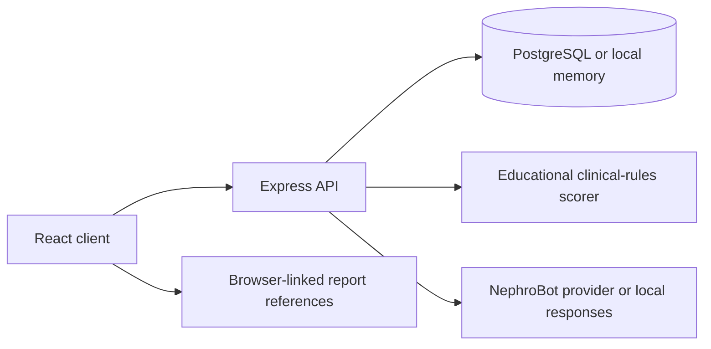

# NephroCare

NephroCare is a bilingual kidney-health education and preliminary screening service. It helps people organise report values, review symptoms, and prepare clearer questions for a qualified clinician.

[Open NephroCare](https://www.nephrocares.in)

> NephroCare does not diagnose chronic kidney disease, prescribe treatment, or replace professional medical care. Its assessment output is educational context for a clinical conversation.

## Product overview

| Area | What it provides |
| --- | --- |
| Assessment | A structured 20-field review of laboratory values and health history |
| Preliminary report | An educational risk estimate with the entered factors that influenced it |
| Symptoms | A 13-sign review organised by urgency and plain-language context |
| My reports | Browser-linked access to assessment and diet-plan references |
| NephroBot | General kidney-health explanations and appointment-question support |
| CKD guide | English and Hindi information about stages, tests, risk factors, and warning signs |
| Exports | Appointment-ready assessment and diet-conversation PDFs |

The service is designed for patients and families in India who may be working from a printed or digital blood or urine report. Unknown fields can be marked rather than guessed, and the core experience is available in English and Hindi.

## Product boundaries

- Assessment results are preliminary educational estimates, not diagnoses.
- Diet content is a discussion guide for a clinician or renal dietitian, not a prescription.
- NephroBot provides general information and must not be used for emergencies or medication decisions.
- Report references are linked to the current browser; the project does not provide authenticated patient accounts.
- Reference ranges and clinical meaning vary by laboratory, medical history, and clinician interpretation.

## Architecture



The Vercel deployment serves the Vite application and routes `/api/*` requests to a single Express function. PostgreSQL is used when `DATABASE_URL` is configured; local development falls back to temporary in-memory storage.

## Technology

- React 18, TypeScript, Vite, and Wouter
- Express, Zod, Drizzle ORM, and PostgreSQL
- TanStack Query and React Hook Form
- Radix UI primitives and Lucide action icons
- Recharts, jsPDF, and html2canvas
- Vercel Functions and Supabase PostgreSQL
- Optional OpenAI API connection for NephroBot, with local educational responses when unavailable

## Local development

### Requirements

- Node.js 20 or newer
- npm
- Optional Supabase PostgreSQL database
- Optional OpenAI API key for provider-backed NephroBot responses

### Setup

```bash
git clone https://github.com/samanyuahuja/NephroCare.git
cd NephroCare
npm ci
cp .env.example .env
npm run dev
```

The development server uses `http://localhost:5000` unless `PORT` is set.

### Environment variables

```dotenv
DATABASE_URL=postgresql://...
DATABASE_POOL_MAX=5
OPENAI_API_KEY=
```

Use a Supabase transaction-pooler URL on port `6543` with `sslmode=require` for serverless deployments. Never commit credentials.

### Useful commands

```bash
npm run dev       # Start the development server
npm run check     # Run TypeScript checks
npm run build     # Build the client and Node server
npm run start     # Run the production build
npm run db:push   # Apply the Drizzle schema
```

## Project structure

```text
api/                 Vercel function entry point
client/src/          React application, pages, components, and utilities
migrations/          PostgreSQL schema migration
server/              Express application, routes, storage, and security controls
shared/              Shared schemas and TypeScript types
DESIGN.md            Interface principles and component rules
PRODUCT.md           Product purpose, users, capabilities, and constraints
```

## Safety and privacy

The API applies schema validation, input sanitisation, request-size limits, rate limits, security headers, and production content-security policy. Secrets remain server-side. The database health state is available at `GET /api/health`.

This repository does not claim clinical certification or validated diagnostic performance. Any future accuracy claim must include the exact dataset, split method, sample size, metric definition, and independent validation evidence.

## Clinical context

Dr. Davindar Chopra of Chopra Hospital, Chandigarh, reviewed the project's public-health intent and provided the recommendation retained in the product. This is presented as a clinician's perspective on the project, not regulatory approval or diagnostic validation.

General learning references used in the CKD guide include the [National Institute of Diabetes and Digestive and Kidney Diseases](https://www.niddk.nih.gov/health-information/kidney-disease/chronic-kidney-disease-ckd/tests-diagnosis) and the [NHS](https://www.nhs.uk/conditions/kidney-disease/diagnosis/).

## Contact

- Email: [nephrocareai@gmail.com](mailto:nephrocareai@gmail.com)
- Instagram: [@nephrocareai](https://www.instagram.com/nephrocareai/)
- Maintainer: [Samanyu Ahuja](https://github.com/samanyuahuja)
